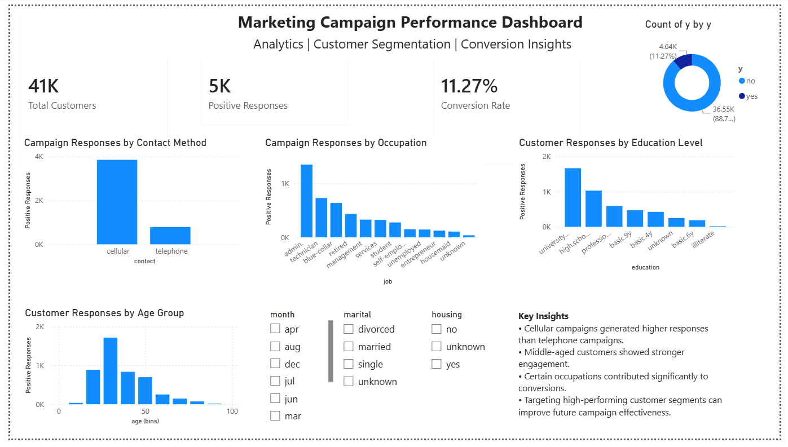

# 📊 Marketing Campaign Performance Dashboard

An interactive Power BI dashboard developed to analyze the effectiveness of bank marketing campaigns and identify customer response patterns. This project focuses on campaign performance evaluation, customer segmentation, and generating actionable insights to support data-driven decision-making.

---

## 🚀 Project Overview

The objective of this project is to analyze direct marketing campaign data from a banking institution and answer key business questions such as:

- Which marketing channels generated the highest customer responses?
- Which customer segments were more likely to subscribe?
- What was the overall campaign conversion rate?
- How can future campaigns be optimized based on historical performance?

This project aligns with real-world campaign analytics responsibilities commonly performed by Data Analysts in the banking industry.

---

## 📌 Key Features

- ✅ Interactive Power BI Dashboard
- ✅ KPI Tracking and Performance Monitoring
- ✅ Customer Segmentation Analysis
- ✅ Campaign Response Analysis
- ✅ Dynamic Filtering using Slicers
- ✅ Actionable Business Insights

---

## 🛠️ Tools & Technologies

- **Power BI Desktop**
- **Microsoft Excel**
- **DAX (Data Analysis Expressions)**

---

## 📂 Dataset

The dashboard utilizes the **Bank Marketing Campaign Dataset**, which contains information about direct marketing campaigns conducted by a banking institution.

### Dataset Information:
- Total Records: **41,188**
- Features: **21**
- Includes:
  - Customer demographics
  - Contact methods
  - Campaign details
  - Previous campaign outcomes
  - Subscription status

---

## 📈 Dashboard Components

### 1. KPI Overview
The dashboard tracks the following key metrics:

- Total Customers Contacted
- Positive Responses
- Conversion Rate

---

### 2. Campaign Analysis

#### Positive Responses by Contact Method
Compares the effectiveness of communication channels such as:
- Cellular
- Telephone

---

### 3. Customer Segmentation

#### Responses by Occupation
Identifies occupations with higher campaign response rates.

#### Responses by Education Level
Analyzes subscription trends across education groups.

#### Responses by Age Group
Evaluates customer engagement patterns across different age segments.

---

### 4. Interactive Filters

Users can dynamically filter the dashboard using:
- Month
- Marital Status
- Housing Loan Status

---

### 5. Business Insights

Key findings generated from the analysis include:

- Cellular campaigns generated significantly higher responses than telephone campaigns.
- Middle-aged customers showed stronger engagement.
- Certain occupations contributed more to successful conversions.
- Targeting high-performing customer segments can improve future campaign effectiveness.

---

## 📊 Key Metrics

| Metric | Value |
|----------|---------|
| Total Customers Contacted | 41,188 |
| Positive Responses | 4,640+ |
| Conversion Rate | 11.27% |

---

## 🎯 Business Impact

This dashboard enables stakeholders to:

- Monitor campaign performance efficiently.
- Identify high-value customer segments.
- Improve targeting strategies.
- Support data-driven marketing decisions.
- Optimize future customer engagement initiatives.

---

## 📸 Dashboard Preview

  

